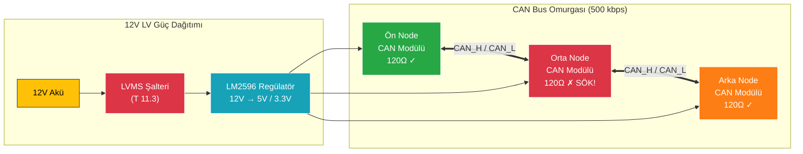
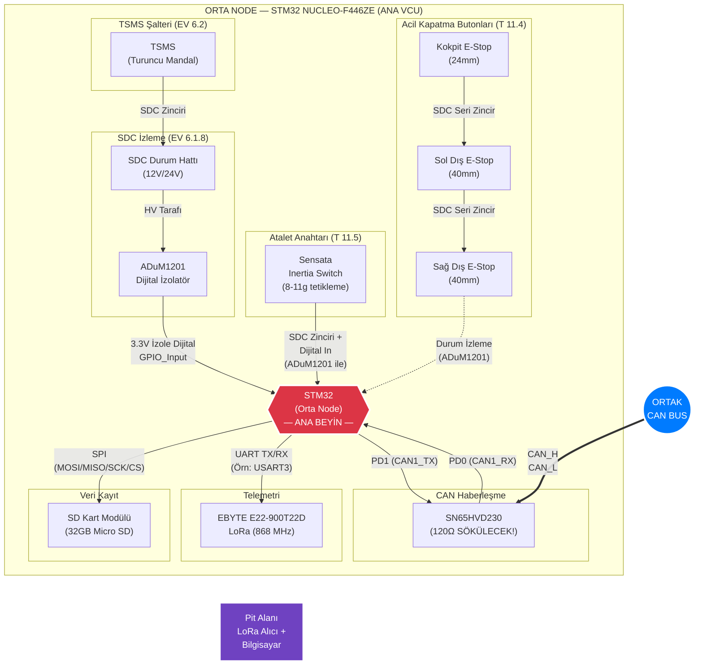
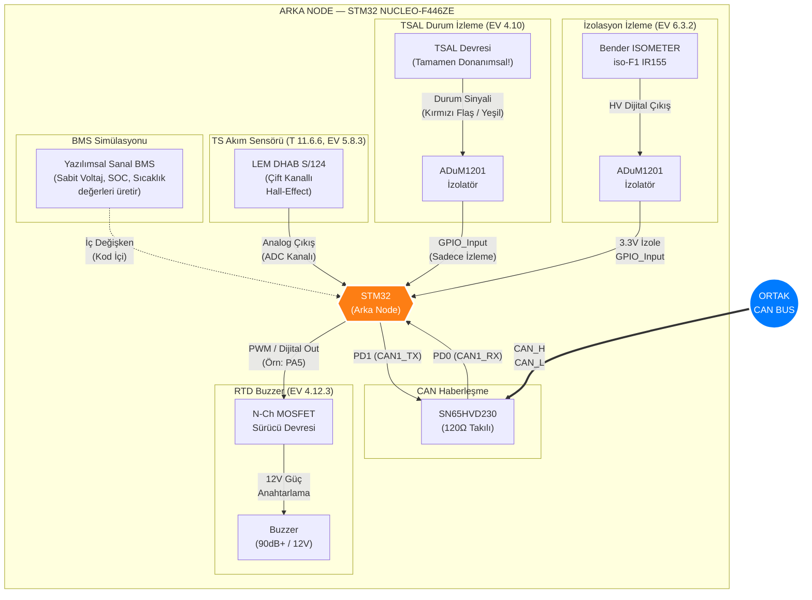
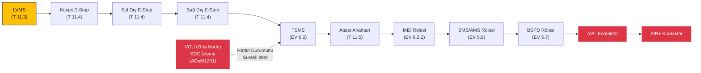
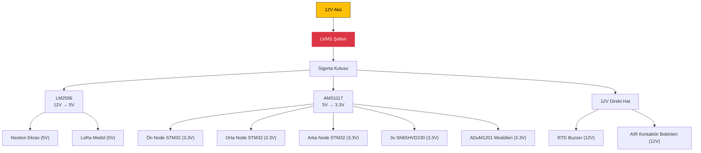

# (TAMAMLANDI) - ARŞİV BELGESİ
Bu belge, projenin ilk aşamasında masaüstü simülasyonları için kullanılmış olup, testler başarıyla bittiği için artık sadece referans/arşiv amacıyla tutulmaktadır.

# FS2026 — Aşırı Ayrıntılı 3-Node Donanım Bağlantı Şeması

> **Kaynak:** [sensor_listesi.csv](file:///home/necdet/1.5/sensorler/sensor_listesi.csv) dosyasından sadece **"Zorunlu"** işaretli sensörler alınmıştır.  
> **Strateji:** BMS ve İnverter fiziksel olarak alınmayacak; ancak mimari olarak varmış gibi tasarlanacaktır (Engineering Design puanı için).

---

## 1. Genel Sistem Topolojisi



> [!IMPORTANT]
> **CAN Sonlandırma Kuralı:** Hattın iki **ucundaki** node'larda (Ön ve Arka) 120Ω sonlandırma direnci takılı kalır. **Ortadaki** node'un CAN modülünden 120Ω direnç sökülerek toplam hat direnci 60Ω'a sabitlenir.

---

## 2. ÖN NODE — Sürücü Kabini (Yeşil Kart)

**Görev:** Sürücünün tüm girdilerini (Gaz, Fren, Start) okumak, Nextion ekrana yazdırmak ve CAN Bus'a iletmek.

```mermaid
graph TD
    subgraph FRONT ["ÖN NODE — STM32 NUCLEO-F446ZE"]
        F_MCU{{"STM32\n(Ön Node)"}}

        subgraph APPS_BLOCK ["APPS — Çift Gaz Pedalı Sensörü (T 11.8.8)"]
            APPS1["APPS Sensör 1\n(10k Pot veya Hall)"]
            APPS2["APPS Sensör 2\n(20k Pot veya Hall)"]
        end
        APPS1 -- "Analog\nPA3 (ADC1_CH3)" --> F_MCU
        APPS2 -- "Analog\nPC0 (ADC1_CH10)" --> F_MCU

        subgraph BRAKE_BLOCK ["Fren Basınç Sensörü (EV 5.7)"]
            BPS["Fren Basınç\nSensörü\n(0-5V / 0-100 Bar)"]
        end
        BPS -- "Analog\nPA1 (ADC1_CH1)\n(Gerilim Bölücü:\n5V→3.3V)" --> F_MCU

        subgraph DRIVER_BLOCK ["Sürücü Butonları"]
            START_BTN["Start Butonu\n(Mavi / Yeşil)"]
        end
        START_BTN -- "Dijital In\nPC13\n(PC817 Optokuplör\nüzerinden izole)" --> F_MCU

        subgraph DISPLAY_BLOCK ["Sürücü Ekranı"]
            NEXTION["Nextion 4.3\"\nNX8048P050\n(Rezistif Dokunmatik)"]
        end
        F_MCU -- "UART TX\n(Örn: USART2_TX)" --> NEXTION
        NEXTION -- "UART RX\n(Örn: USART2_RX)" --> F_MCU

        subgraph FRONT_CAN_BLOCK ["CAN Haberleşme"]
            F_TRANS["SN65HVD230\n(120Ω Takılı)"]
        end
        F_MCU -- "PD1 (CAN1_TX)" --> F_TRANS
        F_TRANS -- "PD0 (CAN1_RX)" --> F_MCU
    end

    F_TRANS == "CAN_H\nCAN_L" ==> CAN_BUS(("ORTAK\nCAN BUS"))

    style F_MCU fill:#28a745,stroke:#fff,stroke-width:3px,color:#fff
    style CAN_BUS fill:#007bff,stroke:#fff,stroke-width:3px,color:#fff
```

### Ön Node Pin Haritası

| Pin | Fonksiyon | Bağlanan Sensör | Protokol | İzolasyon |
|-----|-----------|-----------------|----------|-----------|
| **PA3** | ADC1_CH3 | APPS Sensör 1 (10k Pot) | Analog 0-3.3V | Yok (Düşük voltaj) |
| **PC0** | ADC1_CH10 | APPS Sensör 2 (20k Pot) | Analog 0-3.3V | Yok (Düşük voltaj) |
| **PA1** | ADC1_CH1 | Fren Basınç Sensörü | Analog (Gerilim Bölücü ile 5V→3.3V) | Gerilim Bölücü |
| **PC13** | GPIO_Input | Start / RTD Butonu | Dijital (Pull-up) | **PC817 Optokuplör** |
| **PD0** | CAN1_RX | SN65HVD230 RXD | CAN Bus | Galvanik (Modül içi) |
| **PD1** | CAN1_TX | SN65HVD230 TXD | CAN Bus | Galvanik (Modül içi) |
| **USART2_TX** | UART TX | Nextion Ekran RX | UART 9600/115200 | Yok (3.3V-5V TTL) |
| **USART2_RX** | UART RX | Nextion Ekran TX | UART 9600/115200 | Yok (3.3V-5V TTL) |

### Ön Node'un CAN'e Gönderdiği Mesajlar

| CAN ID | Mesaj Adı | İçerik | Periyot |
|--------|-----------|--------|---------|
| `0x110` | `FRONT_APPS_DATA` | APPS1 %, APPS2 %, Fren Basıncı, Start Butonu Durumu | 10 ms |

---

## 3. ORTA NODE — Ana VCU Beyni (Kırmızı Kart)

**Görev:** Tüm kararları almak (Tork hesaplama, Güvenlik kontrolleri, Durum makinesi), veri kaydetmek (SD Kart) ve telemetri göndermek (LoRa).



### Orta Node Pin Haritası

| Pin | Fonksiyon | Bağlanan Modül | Protokol | İzolasyon |
|-----|-----------|----------------|----------|-----------|
| **PD0** | CAN1_RX | SN65HVD230 RXD | CAN Bus | Galvanik |
| **PD1** | CAN1_TX | SN65HVD230 TXD | CAN Bus | Galvanik |
| **GPIO_x** | GPIO_Input | SDC Durum İzleme | Dijital | **ADuM1201** (Zorunlu!) |
| **GPIO_y** | GPIO_Input | Atalet Anahtarı | Dijital | **ADuM1201** (Zorunlu!) |
| **SPI1_MOSI** | SPI MOSI | SD Kart Modülü | SPI | Yok |
| **SPI1_MISO** | SPI MISO | SD Kart Modülü | SPI | Yok |
| **SPI1_SCK** | SPI Clock | SD Kart Modülü | SPI | Yok |
| **SPI1_CS** | SPI Chip Select | SD Kart Modülü | SPI | Yok |
| **USART3_TX** | UART TX | LoRa Modül RX | UART 9600 | Yok (3.3V) |
| **USART3_RX** | UART RX | LoRa Modül TX | UART 9600 | Yok (3.3V) |

### Orta Node'un CAN Üzerindeki Rolü

| Yön | CAN ID | Mesaj Adı | İçerik | Periyot |
|-----|--------|-----------|--------|---------|
| **RX** (Dinler) | `0x110` | `FRONT_APPS_DATA` | Gaz 1&2 %, Fren, Start | 10 ms |
| **RX** (Dinler) | `0x200` | `BMS_VOLT_CURR` | Batarya V, Akım (Sanal) | 100 ms |
| **RX** (Dinler) | `0x300` | `INV_DYNAMICS` | Motor RPM, Sıcaklık (Sanal) | 50 ms |
| **TX** (Gönderir) | `0x100` | `VCU_CONTROL` | Tork Emri, İnverter İzni | 10 ms |
| **TX** (Gönderir) | `0x101` | `VCU_STATUS` | Araç Durumu, SDC, Hatalar | 20 ms |
| **TX** (Gönderir) | `0x102` | `VCU_FAULTS` | Aktif Hata Kodu | Hata anında |

---

## 4. ARKA NODE — Güç ve Motor Tarafı (Turuncu Kart)

**Görev:** HV (Yüksek Voltaj) tarafındaki sensörleri izlemek, Buzzer çalmak, BMS/İnverter simülasyonu yapmak.



### Arka Node Pin Haritası

| Pin | Fonksiyon | Bağlanan Sensör | Protokol | İzolasyon |
|-----|-----------|-----------------|----------|-----------|
| **PD0** | CAN1_RX | SN65HVD230 RXD | CAN Bus | Galvanik |
| **PD1** | CAN1_TX | SN65HVD230 TXD | CAN Bus | Galvanik |
| **PA5** | GPIO_Output / PWM | MOSFET → Buzzer (12V) | Dijital Out | MOSFET (HV ayrımı) |
| **GPIO_a** | GPIO_Input | IMD (Bender) Durum | Dijital | **ADuM1201** (Zorunlu!) |
| **GPIO_b** | GPIO_Input | TSAL Durum İzleme | Dijital | **ADuM1201** (Zorunlu!) |
| **ADC_x** | ADC Kanalı | LEM DHAB S/124 Akım | Analog | Hall-Effect (Gal. İzole) |

### Arka Node'un CAN Üzerindeki Rolü

| Yön | CAN ID | Mesaj Adı | İçerik | Periyot |
|-----|--------|-----------|--------|---------|
| **RX** (Dinler) | `0x100` | `VCU_CONTROL` | Tork Emri (Buzzer tetiklemesi için) | 10 ms |
| **TX** (Gönderir) | `0x200` | `BMS_VOLT_CURR` | Batarya Voltaj & Akım (Sanal) | 100 ms |
| **TX** (Gönderir) | `0x201` | `BMS_STATUS` | SOC %, Sıcaklık, Hata Kodu (Sanal) | 100 ms |
| **TX** (Gönderir) | `0x310` | `REAR_SENSOR_DATA` | IMD Durumu, TSAL Durumu, TS Akımı | 50 ms |

---

## 5. Shutdown Circuit (SDC) Zinciri — Tüm Araç

Bu devre, araçtaki tüm güvenlik elemanlarının **seri olarak** bağlandığı fiziksel bir elektrik hattıdır. Herhangi biri koparsa tüm araç güvenli şekilde kapanır.



> [!CAUTION]
> **SDC hattı 12V/24V taşır!** STM32 pinleri 3.3V toleranslıdır. SDC'den VCU'ya gelen **her sinyal** mutlaka **ADuM1201 dijital izolatör** üzerinden geçirilmelidir. Aksi halde işlemci yanar.

---

## 6. Güç Dağıtım Şeması



---

## 7. Zorunlu Sensör Özet Tablosu

| # | Sensör | Kural | Node | Bağlantı | İzolasyon |
|---|--------|-------|------|----------|-----------|
| 1 | APPS Sensör 1 (Gaz) | T 11.8.8 | Ön | Analog (PA3) | Yok |
| 2 | APPS Sensör 2 (Gaz) | T 11.8.8 | Ön | Analog (PC0) | Yok |
| 3 | Fren Basınç Sensörü | EV 5.7 | Ön | Analog (PA1) + Gerilim Bölücü | Gerilim Bölücü |
| 4 | Start Butonu | EV 4.12.1 | Ön | Dijital (PC13) | PC817 Optokuplör |
| 5 | SDC Durum İzleme | EV 6.1.8 | Orta | Dijital GPIO | ADuM1201 |
| 6 | Atalet Anahtarı | T 11.5 | Orta | SDC + Dijital GPIO | ADuM1201 |
| 7 | Acil Stop Butonları (3x) | T 11.4 | Orta (İzleme) | SDC Seri Zincir | ADuM1201 |
| 8 | LVMS (Düşük V. Şalteri) | T 11.3 | — | Donanımsal Güç Anahtarı | — |
| 9 | TSMS (TS Şalteri) | EV 6.2 | — | SDC Zinciri | — |
| 10 | RTD Buzzer | EV 4.12.3 | Arka | PWM (PA5) + MOSFET | MOSFET |
| 11 | IMD (İzolasyon İzleme) | EV 6.3.2 | Arka | Dijital GPIO | ADuM1201 |
| 12 | TSAL (Durum İzleme) | EV 4.10 | Arka | Dijital GPIO | ADuM1201 |
| 13 | TS Akım Sensörü | T 11.6.6 | Arka | Analog (ADC) | Hall-Effect (Galvanik) |
| 14 | AMS/BMS | EV 5.8 | Arka | CAN Bus | CAN + ADuM1201 |
| 15 | Motor Resolver | EV 2.1 | Arka | İnverter İç Bağlantısı | İnverter İçi |

---

## 8. CAN Bus Tam Mesaj Akış Tablosu

```text
╔═══════════════════════════════════════════════════════════════════════════╗
║                     CAN BUS — 500 kbps — 11-bit ID                      ║
╠══════════╦═══════╦════════════════════╦═══════════════════╦══════════════╣
║ CAN ID   ║ Yön   ║ Gönderen → Alan    ║ İçerik            ║ Periyot      ║
╠══════════╬═══════╬════════════════════╬═══════════════════╬══════════════╣
║ 0x110    ║ TX    ║ Ön → Orta          ║ APPS1, APPS2,     ║ 10 ms        ║
║          ║       ║                    ║ Fren, Start Btn   ║              ║
╠══════════╬═══════╬════════════════════╬═══════════════════╬══════════════╣
║ 0x100    ║ TX    ║ Orta → Arka (INV)  ║ Tork Emri,        ║ 10 ms        ║
║          ║       ║                    ║ İnverter Enable   ║              ║
╠══════════╬═══════╬════════════════════╬═══════════════════╬══════════════╣
║ 0x101    ║ TX    ║ Orta → Herkese     ║ Araç Durumu,      ║ 20 ms        ║
║          ║       ║                    ║ SDC, Hatalar       ║              ║
╠══════════╬═══════╬════════════════════╬═══════════════════╬══════════════╣
║ 0x102    ║ TX    ║ Orta → Herkese     ║ Aktif Hata Kodu   ║ Hata anında  ║
╠══════════╬═══════╬════════════════════╬═══════════════════╬══════════════╣
║ 0x200    ║ TX    ║ Arka → Orta (BMS)  ║ Batarya Voltaj,   ║ 100 ms       ║
║          ║       ║                    ║ Akım (Sanal)       ║              ║
╠══════════╬═══════╬════════════════════╬═══════════════════╬══════════════╣
║ 0x201    ║ TX    ║ Arka → Orta (BMS)  ║ SOC %, Sıcaklık,  ║ 100 ms       ║
║          ║       ║                    ║ BMS Hata (Sanal)   ║              ║
╠══════════╬═══════╬════════════════════╬═══════════════════╬══════════════╣
║ 0x310    ║ TX    ║ Arka → Orta        ║ IMD, TSAL,        ║ 50 ms        ║
║          ║       ║                    ║ TS Akımı           ║              ║
╚══════════╩═══════╩════════════════════╩═══════════════════╩══════════════╝
```

---

> [!NOTE]
> **Opsiyonel olduğu için bu şemaya dahil EDİLMEYEN sensörler:** IMU (Torque Vectoring iptal edildi), GPS, TPMS (Lastik basınç), Süspansiyon Strok, Tekerlek Hız Sensörleri, Soğutma Sıvısı Sıcaklık Sensörü. Bunlar ileride bütçe oluşursa şemaya eklenebilir.
